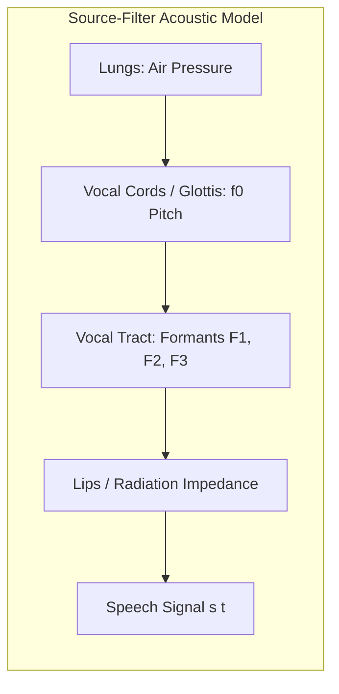
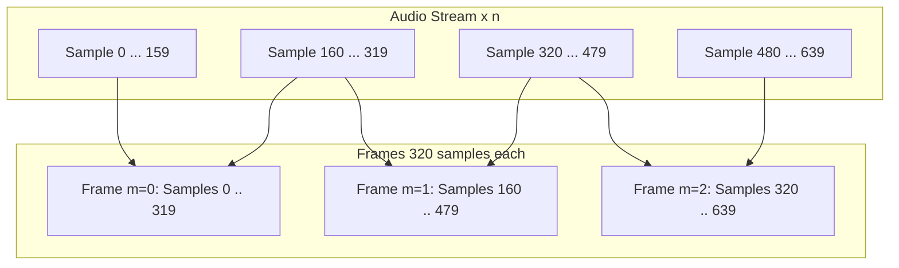
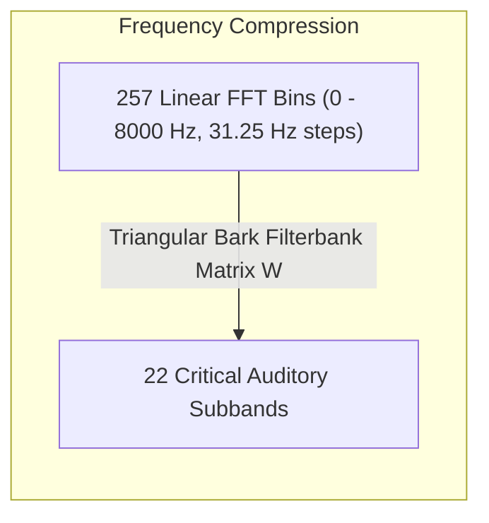
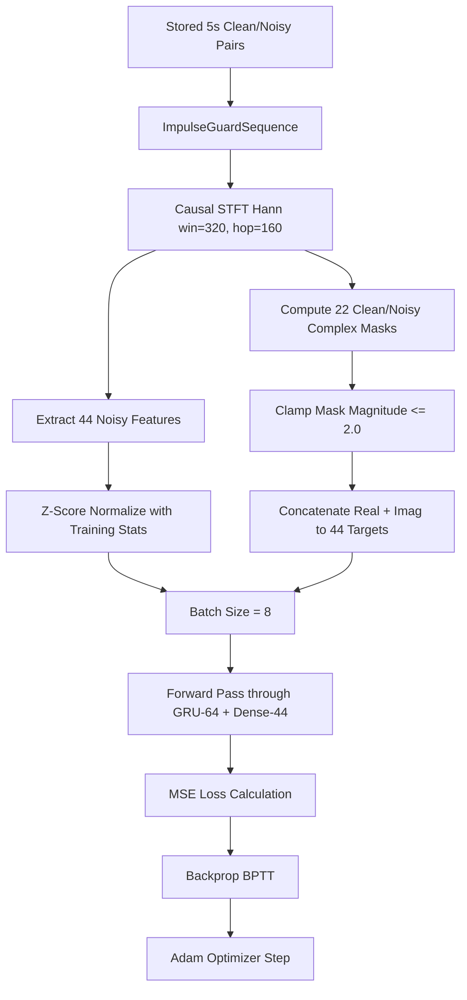
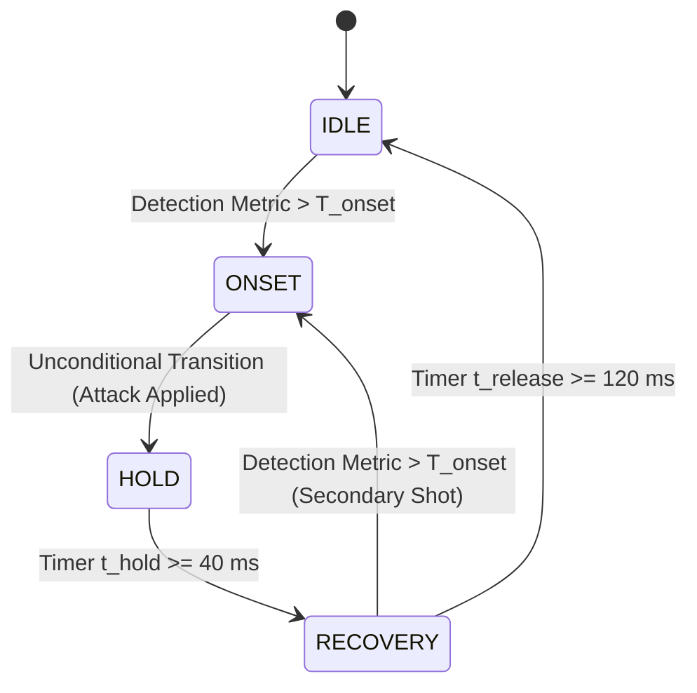
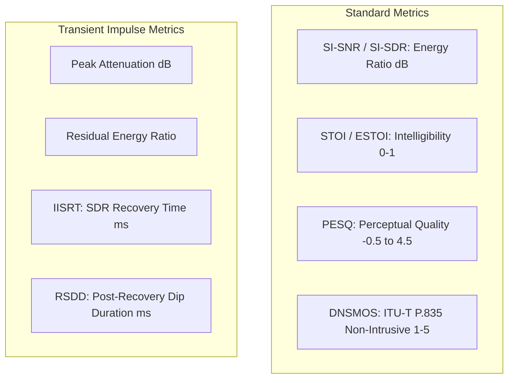
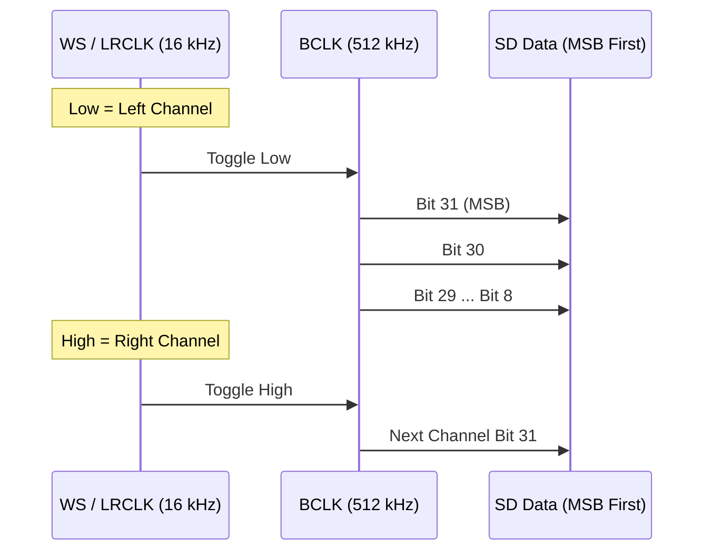

# ImpulseGuard Technical Study Guide: Theory, Mathematics, and Silicon Implementation

This document serves as an exhaustive, textbook-grade technical learning guide for the **ImpulseGuard** speech enhancement system. It covers the complete mathematical, physical, psychoacoustic, and algorithmic foundations of the project, mapping every theoretical formulation directly to its implementation in the codebase and embedded silicon firmware.

---

## Table of Contents

- [1. Digital Audio Fundamentals](#1-digital-audio-fundamentals)
- [2. Acoustic Nature of Speech and Noise](#2-acoustic-nature-of-speech-and-noise)
- [3. Mathematical Formulations of Signal-to-Noise Ratio (SNR)](#3-mathematical-formulations-of-signal-to-noise-ratio-snr)
- [4. Short-Time Fourier Transform (STFT) Theory](#4-short-time-fourier-transform-stft-theory)
- [5. Inverse STFT and Synthesis Window Overlap-Add (OLA)](#5-inverse-stft-and-synthesis-window-overlap-add-ola)
- [6. Discrete Frequency Resolution & Positive Frequency Bins](#6-discrete-frequency-resolution--positive-frequency-bins)
- [7. Psychoacoustics and the Bark Auditory Filterbank](#7-psychoacoustics-and-the-bark-auditory-filterbank)
- [8. Acoustic Feature Extraction Engineering](#8-acoustic-feature-extraction-engineering)
- [9. Recurrent Neural Networks & Gated Recurrent Units (GRU)](#9-recurrent-neural-networks--gated-recurrent-units-gru)
- [10. Neural Speech Enhancement & Complex Spectral Masking](#10-neural-speech-enhancement--complex-spectral-masking)
- [11. End-to-End Supervised Model Training Pipeline](#11-end-to-end-supervised-model-training-pipeline)
- [12. Acoustic Mixture Synthesis & Split Partitioning](#12-acoustic-mixture-synthesis--split-partitioning)
- [13. Theory of Impulsive Noise Detection (V2 Architecture)](#13-theory-of-impulsive-noise-detection-v2-architecture)
- [14. Temporal Transient State Machine Dynamics](#14-temporal-transient-state-machine-dynamics)
- [15. Dynamic Envelope Control: Attack, Hold, and Release](#15-dynamic-envelope-control-attack-hold-and-release)
- [16. Objective Evaluation Metrics & Recovery Dynamics](#16-objective-evaluation-metrics--recovery-dynamics)
- [17. Latency Decomposition & Real-Time Constraints](#17-latency-decomposition--real-time-constraints)
- [18. Edge-AI Engineering & Integer Quantization (INT8)](#18-edge-ai-engineering--integer-quantization-int8)
- [19. Espressif ESP32-S3 Microcontroller Architecture](#19-espressif-esp32-s3-microcontroller-architecture)
- [20. Inter-IC Sound (I2S) Protocol & DMA Buffering](#20-inter-ic-sound-i2s-protocol--dma-buffering)
- [21. INMP441 Digital MEMS Microphone Interface](#21-inmp441-digital-mems-microphone-interface)
- [22. MAX98357A I2S Class-D Audio Amplifier](#22-max98357a-i2s-class-d-audio-amplifier)
- [23. End-to-End Execution Trace of One 10 ms Audio Frame](#23-end-to-end-execution-trace-of-one-10-ms-audio-frame)

---

## 1. Digital Audio Fundamentals

### 1.1 Continuous Waves to Discrete Signals
Sound is a longitudinal mechanical pressure wave propagating through a fluid medium (such as air). Let $p(t)$ denote continuous instantaneous acoustic pressure at time $t \in \mathbb{R}$.

To process acoustic waves digitally, the continuous pressure wave is converted into a continuous electrical voltage by a microphone diaphragm, and subsequently converted into a discrete-time, discrete-amplitude sequence $x[n]$ by an Analog-to-Digital Converter (ADC):

$$x[n] = \mathcal{Q}\left(p(n \cdot T_s)\right), \quad n \in \mathbb{Z}$$

where:
- $T_s$ is the sampling interval (seconds).
- $f_s = \frac{1}{T_s}$ is the sampling frequency (samples per second, Hz).
- $\mathcal{Q}(\cdot)$ represents the non-linear amplitude quantization operator.

In ImpulseGuard, the sample rate is globally fixed to **$f_s = 16,000\text{ Hz}$** ([`src/config.py:L1`](file:///home/agniva/impuse-guard/src/config.py#L1)), yielding a sampling interval $T_s = \frac{1}{16000} = 62.5\ \mu\text{s}$.

### 1.2 Nyquist-Shannon Sampling Theorem
The Nyquist-Shannon sampling theorem states that a continuous bandlimited signal $p(t)$ containing no frequency components at or above frequency $B$ can be perfectly and uniquely reconstructed from its discrete samples $x[n]$ if and only if:

$$f_s > 2B \implies B < \frac{f_s}{2}$$

The critical boundary $f_{\text{Nyquist}} = \frac{f_s}{2}$ is the **Nyquist frequency**. For ImpulseGuard:

$$f_{\text{Nyquist}} = \frac{16,000}{2} = 8,000\text{ Hz} = 8\text{ kHz}$$

Any continuous signal component above $8\text{ kHz}$ will fold back (alias) into the audible band $[0, 8\text{ kHz}]$ as phantom distortion:

$$f_{\text{alias}} = |f - k \cdot f_s|$$

An analog low-pass anti-aliasing filter or delta-sigma decimator inside the INMP441 MEMS microphone strictly attenuates content above $8\text{ kHz}$ before digital transmission.

### 1.3 Uniform Quantization and Linear Pulse Code Modulation (PCM)
In uniform linear PCM with word length $B_{\text{bits}}$, the continuous voltage range $[-V_{\text{ref}}, +V_{\text{ref}}]$ is partitioned into $2^{B_{\text{bits}}}$ discrete quantization levels. The quantization step size (least significant bit, LSB) is:

$$\Delta = \frac{2 V_{\text{ref}}}{2^{B_{\text{bits}}}} = 2^{1 - B_{\text{bits}}} V_{\text{ref}}$$

The quantization error $e[n] = x[n] - p(n T_s)$ is bounded by $[-\frac{\Delta}{2}, +\frac{\Delta}{2}]$. Assuming $e[n]$ is uniformly distributed white noise, the quantization noise power is:

$$P_e = \sigma_e^2 = \int_{-\Delta/2}^{+\Delta/2} e^2 \left(\frac{1}{\Delta}\right) de = \frac{\Delta^2}{12}$$

The maximum theoretical Signal-to-Quantization-Noise Ratio (SQNR) for a full-scale sinusoidal signal of amplitude $V_{\text{ref}}$ ($P_{\text{signal}} = \frac{V_{\text{ref}}^2}{2}$) is:

$$\text{SQNR}_{\text{max}} = 10 \log_{10}\left(\frac{V_{\text{ref}}^2 / 2}{\Delta^2 / 12}\right) = 10 \log_{10}\left(1.5 \cdot 2^{2 B_{\text{bits}}}\right) \approx 6.02 \cdot B_{\text{bits}} + 1.76\text{ dB}$$

- For standard **16-bit PCM** (`int16_t`):
  $$\text{SQNR} \approx 6.02 \times 16 + 1.76 = 98.08\text{ dB}$$
- The 16-bit integer values span $[-32768, +32767]$.
- In ImpulseGuard's Python code, signals are normalized to float32 in range $[-1.0, +1.0]$:
  $$x_{\text{float}}[n] = \frac{x_{\text{int16}}[n]}{32768.0}$$
  In ESP32 C++ firmware ([`firmware/esp32_impulse_guard/src/stft.cpp:L37`](file:///home/agniva/impuse-guard/firmware/esp32_impulse_guard/src/stft.cpp#L37)), this normalization is performed during FFT window application.

### 1.4 Signal Energy, RMS, and Peak Amplitude
For an audio segment of length $N$ samples:
- **Peak Amplitude**:
  $$A_{\text{peak}} = \max_{n=0}^{N-1} |x[n]|$$
- **Root Mean Square (RMS)**:
  $$x_{\text{RMS}} = \sqrt{\frac{1}{N} \sum_{n=0}^{N-1} x[n]^2}$$
- **Crest Factor**:
  $$\text{CF} = \frac{A_{\text{peak}}}{x_{\text{RMS}}}, \quad \text{CF}_{\text{dB}} = 20 \log_{10}(\text{CF})$$
  Continuous speech typically exhibits a crest factor between 12 dB and 18 dB. In contrast, gunshot impulses exhibit extreme crest factors exceeding 25–35 dB.

---

## 2. Acoustic Nature of Speech and Noise

### 2.1 Speech Signal Physics
Human speech is produced via the source-filter model of vocal acoustics:
1. **Source**: Quasi-periodic glottal airflow pulses for voiced sounds (vowels, nasals) with fundamental frequency $f_0 \in [80, 300]\text{ Hz}$, or turbulent noise generated at vocal tract constrictions for unvoiced sounds (/s/, /f/, /t/).
2. **Filter**: The vocal tract acts as an acoustic resonator, creating distinct spectral resonance peaks termed **formants** ($F_1, F_2, F_3, \dots$).

Speech is inherently **non-stationary** over long horizons, but exhibits **quasi-stationarity** over short temporal intervals of 20–30 ms. This physical property forms the basis for framing audio into 20 ms analysis windows.



### 2.2 Stationary Noise
Stationary noise exhibits constant statistical properties (mean, variance, auto-correlation) over time:
$$\mathbb{E}[n(t)] = \mu, \quad \mathbb{E}[n(t) n(t - \tau)] = R_{nn}(\tau)$$
Examples in ImpulseGuard include **engine idling noise** (`UrbanSound8K` class 5) and constant mechanical hums. Stationary noise can be tracked using classical recursive spectral estimators.

### 2.3 Non-Stationary Noise
Non-stationary noise possesses time-varying spectral distributions:
$$\mathbb{E}[n(t_1) n(t_2)] \neq R_{nn}(t_1 - t_2)$$
Examples in ImpulseGuard include:
- **Drone Rotor Noise**: Discrete harmonic blade-pass frequency lines ($f_{\text{BPF}} = \frac{\text{RPM} \times \text{Blades}}{60}$) that sweep dynamically as motor throttle modulates.
- **Police / Ambulance Sirens**: Frequency-modulated chirps traversing 500 Hz to 3,000 Hz.
- **Wind Noise**: Turbulent vortex shedding producing stochastic low-frequency pressure surges.

### 2.4 Impulsive Noise (The Core Threat)
Impulsive noise consists of high-energy acoustic shockwaves lasting from a few microseconds to under 50 milliseconds. In ImpulseGuard, gunshots from `UrbanSound8K` (`classID = 6`) represent the primary impulse threat.

Physical attributes of gunshot impulses:
1. **Shockwave Discontinuity**: Instantaneous rise time ($< 100\ \mu\text{s}$) characterized by an $N$-wave pressure profile.
2. **Infinite Theoretical Bandwidth**: In the frequency domain, an ideal Dirac delta impulse $\delta(t)$ has uniform spectral density across all frequencies:
   $$\mathcal{F}\{\delta(t)\} = 1, \quad \forall \omega$$
3. **Severe Local SNR Collapse**: The instantaneous SNR plummets below -30 dB within the impulse window.
4. **Failure of Classical Filters**: Classical noise suppression filters track noise floors via recursive smoothing:
   $$\hat{\sigma}^2_N[k, m] = \alpha \hat{\sigma}^2_N[k, m-1] + (1 - \alpha) |Y[k, m]|^2$$
   When an impulse arrives, the huge $|Y[k, m]|^2$ spike corrupts the noise floor estimate $\hat{\sigma}^2_N$. After the impulse passes, $\alpha \approx 0.95$ causes the filter to treat ongoing clean speech as noise, suppressing the speaker's voice for hundreds of milliseconds. This phenomenon is called **Impulse-Induced Recovery Lag**.

---

## 3. Mathematical Formulations of Signal-to-Noise Ratio (SNR)

### 3.1 Time-Domain SNR
Consider a discrete-time signal $y[n]$ composed of clean speech $s[n]$ corrupted by additive noise $v[n]$:
$$y[n] = s[n] + v[n]$$

The standard Signal-to-Noise Ratio (SNR) in decibels is defined as:

$$\text{SNR}_{\text{dB}} = 10 \log_{10}\left(\frac{P_{\text{speech}}}{P_{\text{noise}}}\right) = 10 \log_{10}\left(\frac{\sum_{n=0}^{N-1} s[n]^2}{\sum_{n=0}^{N-1} v[n]^2}\right)$$

### 3.2 SNR Scaling in Dataset Generation
In [`scripts/mix_data.py:L142-L162`](file:///home/agniva/impuse-guard/scripts/mix_data.py#L142-L162), noise is dynamically scaled to match a specified target SNR:

$$\text{RMS}_s = \sqrt{\frac{1}{N} \sum_{n=0}^{N-1} s[n]^2}, \quad \text{RMS}_v = \sqrt{\frac{1}{N} \sum_{n=0}^{N-1} v[n]^2}$$

$$\text{Target RMS}_v = \frac{\text{RMS}_s}{10^{\frac{\text{SNR}_{\text{target}}}{20}}}$$

$$\alpha = \frac{\text{Target RMS}_v}{\text{RMS}_v + \epsilon} \implies v_{\text{scaled}}[n] = \alpha \cdot v[n]$$

### 3.3 Scale-Invariant Signal-to-Noise Ratio (SI-SNR)
Standard SNR is sensitive to overall gain and scaling discrepancies between the estimated signal $\hat{s}$ and the ground truth $s$. If $\hat{s}[n] = 2 s[n]$, standard SNR reports massive error despite zero perceptual distortion.

To resolve this, ImpulseGuard uses **Scale-Invariant Signal-to-Noise Ratio (SI-SNR)** ([`src/evaluation/metrics.py:L29-L48`](file:///home/agniva/impuse-guard/src/evaluation/metrics.py#L29-L48)). First, zero-mean centering is performed:
$$\mathbf{s} = s - \frac{1}{N} \sum_{n=0}^{N-1} s[n], \quad \mathbf{\hat{s}} = \hat{s} - \frac{1}{N} \sum_{n=0}^{N-1} \hat{s}[n]$$

The estimate $\mathbf{\hat{s}}$ is decomposed into an orthogonal projection along $\mathbf{s}$ ($\mathbf{e}_{\text{target}}$) and an orthogonal error residual ($\mathbf{e}_{\text{res}}$):

$$\mathbf{e}_{\text{target}} = \frac{\langle \mathbf{\hat{s}}, \mathbf{s} \rangle}{\|\mathbf{s}\|^2 + \epsilon} \mathbf{s}$$

$$\mathbf{e}_{\text{res}} = \mathbf{\hat{s}} - \mathbf{e}_{\text{target}}$$

$$\text{SI-SNR} = 10 \log_{10}\left(\frac{\|\mathbf{e}_{\text{target}}\|^2}{\|\mathbf{e}_{\text{res}}\|^2 + \epsilon}\right) = 10 \log_{10}\left(\frac{\sum_{n} e_{\text{target}}[n]^2}{\sum_{n} e_{\text{res}}[n]^2 + 10^{-8}}\right)$$

The **SI-SNR Improvement** ($\Delta \text{SI-SNR}$) evaluates the net denoising gain:
$$\Delta \text{SI-SNR} = \text{SI-SNR}(\mathbf{s}, \mathbf{\hat{s}}_{\text{enhanced}}) - \text{SI-SNR}(\mathbf{s}, \mathbf{y}_{\text{noisy}})$$

---

## 4. Short-Time Fourier Transform (STFT) Theory

### 4.1 Limitations of the Global Discrete Fourier Transform (DFT)
The discrete Fourier transform of a finite sequence $x[n]$ of length $N$:
$$X[k] = \sum_{n=0}^{N-1} x[n] e^{-j \frac{2\pi}{N} k n}, \quad k = 0, \dots, N-1$$
integrates over the entire signal duration. It discloses which frequencies are present, but provides zero temporal localization regarding *when* an event (such as a gunshot) occurs.

### 4.2 STFT Definition and Framing
To obtain time-localized spectral information, the signal is partitioned into overlapping short frames using a sliding analysis window $w[n]$:

$$X[m, k] = \sum_{n=0}^{N_{\text{frame}}-1} x[m \cdot N_{\text{hop}} + n] \cdot w[n] \cdot e^{-j \frac{2\pi}{N_{\text{FFT}}} k n}$$

where:
- $m \in \mathbb{Z}$ is the discrete time frame index.
- $k \in \{0, 1, \dots, N_{\text{FFT}}-1\}$ is the discrete frequency bin index.
- $N_{\text{frame}} = 320$ samples ($20.0\text{ ms}$ at $16\text{ kHz}$).
- $N_{\text{hop}} = 160$ samples ($10.0\text{ ms}$ at $16\text{ kHz}$, 50% overlap).
- $N_{\text{FFT}} = 512$ points (zero-padded from 320 to 512).



### 4.3 Analysis Window: The Hann Window
ImpulseGuard uses the periodic Hann window:

$$w[n] = 0.5 \left(1 - \cos\left(\frac{2\pi n}{N_{\text{frame}}}\right)\right), \quad n = 0, 1, \dots, N_{\text{frame}}-1$$

Properties of the Hann window:
- **Mainlobe Width**: $8\pi / N_{\text{frame}}$, providing clean frequency separation.
- **Sidelobe Attenuation**: First sidelobe is attenuated by $-31.5\text{ dB}$, preventing distant spectral leakage from corrupting weak speech formants.
- **Strict Causality**: In [`src/stft.py:L14`](file:///home/agniva/impuse-guard/src/stft.py#L14), `center=False` is set. When `center=True`, librosa pads the beginning of the audio by $N_{\text{FFT}}/2$ samples, introducing $16\text{ ms}$ of non-causal lookahead latency. Setting `center=False` ensures zero lookahead, matching the physical behavior of real-time streaming firmware on the ESP32-S3.

---

## 5. Inverse STFT and Synthesis Window Overlap-Add (OLA)

### 5.1 Reconstructing Time-Domain Signals
Given an enhanced complex time-frequency spectrum $\hat{Y}[m, k]$, the time-domain frame is recovered using the Inverse Discrete Fourier Transform (IDFT):

$$\hat{y}_m[n] = \frac{1}{N_{\text{FFT}}} \sum_{k=0}^{N_{\text{FFT}}-1} \hat{Y}[m, k] e^{+j \frac{2\pi}{N_{\text{FFT}}} k n}, \quad n = 0, \dots, N_{\text{frame}}-1$$

### 5.2 Overlap-Add (OLA) Synthesis
Because frames overlap by $N_{\text{hop}} = 160$ samples, the synthesized frames are re-windowed by a synthesis window $w_s[n]$ (identical to the analysis Hann window $w[n]$) and accumulated along the temporal timeline:

$$\hat{y}[t] = \frac{\sum_{m} \hat{y}_m[t - m N_{\text{hop}}] \cdot w_s[t - m N_{\text{hop}}]}{\sum_{m} w[t - m N_{\text{hop}}] \cdot w_s[t - m N_{\text{hop}}]}$$

In ImpulseGuard, because $w_s[n] = w[n]$ and the overlap is exactly 50% ($N_{\text{hop}} = N_{\text{frame}} / 2$), exactly two windows overlap at any sample $n \in [0, N_{\text{hop}}-1]$:

$$D[n] = w[n]^2 + w[n + N_{\text{hop}}]^2$$

Substituting the Hann window equation:
$$w[n] = 0.5 - 0.5 \cos\left(\frac{2\pi n}{N}\right)$$
$$w[n + N/2] = 0.5 - 0.5 \cos\left(\frac{2\pi n}{N} + \pi\right) = 0.5 + 0.5 \cos\left(\frac{2\pi n}{N}\right)$$
$$w[n]^2 + w[n + N/2]^2 = \left(0.5 - 0.5 \cos\theta\right)^2 + \left(0.5 + 0.5 \cos\theta\right)^2 = 0.5 + 0.5 \cos^2\theta$$

Notice that the sum of squared Hann windows is **not constant** (it varies between 0.5 and 1.0). Therefore, **window normalization is mandatory** to prevent 100 Hz amplitude modulation flutter in the reconstructed audio.

In the ESP32 firmware ([`firmware/esp32_impulse_guard/src/istft.cpp:L37-L49`](file:///home/agniva/impuse-guard/firmware/esp32_impulse_guard/src/istft.cpp#L37-L49)), this is implemented in `istft_init()`:
```cpp
for (int n = 0; n < HOP_SIZE; n++) {
    float w1 = hann_window[n];
    float w2 = hann_window[n + HOP_SIZE];
    window_norm[n] = w1 * w1 + w2 * w2;
    if (window_norm[n] < 1e-8f) window_norm[n] = 1.0f;
}
```
During synthesis, each sample is divided by `window_norm[n]` before being output to the I2S DMA buffer ([`istft.cpp:L163`](file:///home/agniva/impuse-guard/firmware/esp32_impulse_guard/src/istft.cpp#L163)).

---

## 6. Discrete Frequency Resolution & Positive Frequency Bins

### 6.1 Why 512 FFT Size Produces 257 Bins
For a real-valued input sequence $x[n] \in \mathbb{R}$, the Discrete Fourier Transform exhibits **Hermitian symmetry**:

$$X[N_{\text{FFT}} - k] = X^*[k]$$

where $*$ denotes complex conjugation:
$$\text{Re}(X[N_{\text{FFT}} - k]) = \text{Re}(X[k]), \quad \text{Im}(N_{\text{FFT}} - k) = -\text{Im}(X[k])$$

Because the negative frequencies $k \in [N_{\text{FFT}}/2 + 1, N_{\text{FFT}}-1]$ are the mirror image of the positive frequencies, only the non-redundant bins from DC ($k=0$) up to the Nyquist frequency ($k=N_{\text{FFT}}/2$) are needed:

$$K = \frac{N_{\text{FFT}}}{2} + 1 = \frac{512}{2} + 1 = 257\text{ frequency bins}$$

Defined in [`src/config.py:L7`](file:///home/agniva/impuse-guard/src/config.py#L7):
```python
NUM_FREQ_BINS = FFT_SIZE // 2 + 1  # 257
```

### 6.2 Frequency Bin Width and Spacing
The physical frequency corresponding to discrete bin $k \in \{0, 1, \dots, 256\}$ is:

$$f_k = k \cdot \frac{f_s}{N_{\text{FFT}}} = k \cdot \frac{16,000}{512} = k \cdot 31.25\text{ Hz}$$

- Bin $k = 0$: $0.0\text{ Hz}$ (DC component, purely real)
- Bin $k = 1$: $31.25\text{ Hz}$
- Bin $k = 100$: $3,125.0\text{ Hz}$
- Bin $k = 256$: $256 \times 31.25 = 8,000.0\text{ Hz}$ (Nyquist frequency, purely real)

### 6.3 Reconstructing the Negative Frequencies for IFFT
On the ESP32, the fast radix-2 FFT function (`dsps_fft2r_fc32`) expects a full 512-point complex buffer. In [`firmware/esp32_impulse_guard/src/istft.cpp:L87-L116`](file:///home/agniva/impuse-guard/firmware/esp32_impulse_guard/src/istft.cpp#L87-L116), the full spectrum is reconstituted from the 257 enhanced bins via conjugate symmetry:

```cpp
// DC bin
fft_buffer[0] = enhanced_real[0];
fft_buffer[1] = 0.0f;

// Positive and conjugate mirror bins
for (int k = 1; k < NUM_FREQ_BINS - 1; k++) {
    fft_buffer[2 * k] = enhanced_real[k];
    fft_buffer[2 * k + 1] = enhanced_imag[k];

    int mirror = FFT_SIZE - k;
    fft_buffer[2 * mirror] = enhanced_real[k];
    fft_buffer[2 * mirror + 1] = -enhanced_imag[k];
}

// Nyquist bin
fft_buffer[2 * 256] = enhanced_real[256];
fft_buffer[2 * 256 + 1] = 0.0f;
```

---

## 7. Psychoacoustics and the Bark Auditory Filterbank

### 7.1 Human Auditory Perception & Critical Bands
The human cochlea operates as a biological spectrum analyzer. Traveling waves along the basilar membrane peak at different spatial positions according to frequency (tonotopic organization). The human ear does not perceive sound frequency linearly; rather, frequency resolution is sharp at low frequencies ($< 500\text{ Hz}$) and broad at high frequencies ($> 2,000\text{ Hz}$).

### 7.2 The Bark Scale Formula
The Bark scale (introduced by Eberhard Zwicker in 1961) maps acoustic frequency (Hz) to critical band rate (Bark):

$$z(f) = 13.0 \arctan(0.00076 f) + 3.5 \arctan\left(\left(\frac{f}{7500}\right)^2\right)$$

Implemented in [`src/subbands.py:L12-L22`](file:///home/agniva/impuse-guard/src/subbands.py#L12-L22) and in ESP32 C++ [`firmware/esp32_impulse_guard/src/subbands.cpp:L8-L15`](file:///home/agniva/impuse-guard/firmware/esp32_impulse_guard/src/subbands.cpp#L8-L15):
```python
def hz_to_bark(frequency):
    return (
        13.0 * np.arctan(0.00076 * frequency)
        + 3.5 * np.arctan((frequency / 7500.0) ** 2)
    )
```

At $f = 0\text{ Hz} \implies z(0) = 0\text{ Bark}$.
At $f = 8,000\text{ Hz} \implies z(8000) \approx 20.98\text{ Bark}$.



### 7.3 Construction of 22 Triangular Bark Filters
ImpulseGuard compresses 257 linear frequency bins into **22 critical subbands** (`NUM_SUBBANDS = 22` in [`src/config.py:L9`](file:///home/agniva/impuse-guard/src/config.py#L9)).
1. Spacing 24 points uniformly in Bark space:
   $$\text{bark\_points} = \text{linspace}(z(0), z(8000), 22 + 2)$$
2. Inverting Bark to Hz using numerical interpolation across a 10,000-point table (`bark_to_hz`).
3. Mapping Hz to FFT bin indices:
   $$k_{\text{bin}} = \left\lfloor \frac{(N_{\text{FFT}} + 1) \cdot f_{\text{Hz}}}{f_s} \right\rfloor = \left\lfloor \frac{513 \cdot f_{\text{Hz}}}{16000} \right\rfloor$$
4. Constructing triangular filters for each band $b \in \{0, \dots, 21\}$ with left boundary $k_L$, center $k_C$, and right boundary $k_R$:

$$W[b, k] = \begin{cases} 
\frac{k - k_L}{k_C - k_L}, & k_L \le k < k_C \\ 
\frac{k_R - k}{k_R - k_C}, & k_C \le k \le k_R \\ 
0, & \text{otherwise} 
\end{cases}$$

Filterbank matrix $W$ has dimension **$(22, 257)$**.

---

## 8. Acoustic Feature Extraction Engineering

In [`src/subbands.py:L164-L308`](file:///home/agniva/impuse-guard/src/subbands.py#L164-L308), the input complex STFT matrix is transformed into a compact 44-dimensional feature vector per frame.

### 8.1 Step 1: Power Spectrum
For each complex STFT frame $X[k] \in \mathbb{C}$:
$$P[k] = |X[k]|^2 = \text{Re}(X[k])^2 + \text{Im}(X[k])^2, \quad k = 0, \dots, 256$$

### 8.2 Step 2: Subband Bark Energy
The 257 power bins are projected into 22 Bark subbands via matrix-vector multiplication:
$$\mathbf{E}_{\text{band}}[b] = \sum_{k=0}^{256} W[b, k] \cdot P[k], \quad b = 0, \dots, 21$$

### 8.3 Step 3: Logarithmic Energy
Human loudness perception is logarithmic. The subband energies are converted to decibels:
$$\mathbf{L}_t[b] = 10 \log_{10}\left(\mathbf{E}_{\text{band}}[b] + 10^{-10}\right), \quad b = 0, \dots, 21$$
where $10^{-10}$ prevents $\log(0)$ numerical underflow.

### 8.4 Step 4: Temporal Delta Energy (First-Order Difference)
To inform the neural network about transient energy onsets (such as gunshot wavefronts), first-order temporal derivatives are calculated across adjacent frames:

$$\mathbf{\Delta}_t[b] = \begin{cases} 
0, & t = 0 \\ 
\mathbf{L}_t[b] - \mathbf{L}_{t-1}[b], & t \ge 1 
\end{cases}$$

### 8.5 Step 5: Feature Concatenation & Normalization
The 22 instantaneous log energies and 22 temporal differences are concatenated into a **44-dimensional feature vector**:

$$\mathbf{f}_t = \left[\mathbf{L}_t[0], \dots, \mathbf{L}_t[21], \mathbf{\Delta}_t[0], \dots, \mathbf{\Delta}_t[21]\right]^T \in \mathbb{R}^{44}$$

Z-score normalization is applied using pre-calculated statistics from training clean speech ([`src/feature_normalization.py:L41-L54`](file:///home/agniva/impuse-guard/src/feature_normalization.py#L41-L54)):

$$\mathbf{\tilde{f}}_t[i] = \frac{\mathbf{f}_t[i] - \mu_i}{\sigma_i + 10^{-8}}, \quad i = 0, \dots, 43$$

From [`data/metadata/feature_normalization.json`](file:///home/agniva/impuse-guard/data/metadata/feature_normalization.json), computed over 12,134 training files (15,280,016 frames):
- Features 0–21 ($\mu \in [-4.07, -26.36]\text{ dB}, \sigma \in [15.12, 20.20]\text{ dB}$)
- Features 22–43 ($\mu \approx 0.000\text{ dB}, \sigma \in [4.47, 6.13]\text{ dB}$)

---

## 9. Recurrent Neural Networks & Gated Recurrent Units (GRU)

### 9.1 Why GRU Replaces Standard RNN
Standard Recurrent Neural Networks (RNNs) suffer from the **vanishing and exploding gradient problem** during Backpropagation Through Time (BPTT). In speech enhancement, where an utterance spans 500 frames ($5\text{ seconds}$), computing gradients through 500 recurrent matrix multiplications results in exponential decay:

$$\frac{\partial \mathbf{h}_T}{\partial \mathbf{h}_t} = \prod_{j=t+1}^{T} \frac{\partial \mathbf{h}_j}{\partial \mathbf{h}_{j-1}} \to 0 \quad \text{as } (T - t) \to \infty$$

The Gated Recurrent Unit (Cho et al., 2014) introduces **additive shortcut connections** modulated by an update gate $\mathbf{z}_t$, allowing gradients to flow backward indefinitely without attenuation.

### 9.2 Complete Mathematical GRU Gate Equations
At frame $t$, given normalized input $\mathbf{x}_t \in \mathbb{R}^{44}$ and recurrent state $\mathbf{h}_{t-1} \in \mathbb{R}^{64}$:

1. **Update Gate $\mathbf{z}_t$**: Decides how much previous memory $\mathbf{h}_{t-1}$ to carry forward:
   $$\mathbf{z}_t = \sigma\left(\mathbf{W}_z \mathbf{x}_t + \mathbf{U}_z \mathbf{h}_{t-1} + \mathbf{b}_{iz} + \mathbf{b}_{hz}\right)$$
2. **Reset Gate $\mathbf{r}_t$**: Determines how much of the past memory to ignore when forming the candidate state:
   $$\mathbf{r}_t = \sigma\left(\mathbf{W}_r \mathbf{x}_t + \mathbf{U}_r \mathbf{h}_{t-1} + \mathbf{b}_{ir} + \mathbf{b}_{hr}\right)$$
3. **Candidate Hidden State $\mathbf{\tilde{h}}_t$**:
   $$\mathbf{\tilde{h}}_t = \tanh\left(\mathbf{W}_h \mathbf{x}_t + \mathbf{b}_{ih} + \mathbf{r}_t \odot (\mathbf{U}_h \mathbf{h}_{t-1} + \mathbf{b}_{hh})\right)$$
4. **Final Hidden State $\mathbf{h}_t$**:
   $$\mathbf{h}_t = (1 - \mathbf{z}_t) \odot \mathbf{h}_{t-1} + \mathbf{z}_t \odot \mathbf{\tilde{h}}_t$$

where:
- $\sigma(u) = \frac{1}{1 + e^{-u}}$ is the logistic sigmoid function.
- $\tanh(u) = \frac{e^u - e^{-u}}{e^u + e^{-u}}$ is the hyperbolic tangent function.
- $\odot$ represents the Hadamard element-wise product.

### 9.3 Exact Parameter Count Derivation
The ImpulseGuard model ([`src/model.py:L26-L39`](file:///home/agniva/impuse-guard/src/model.py#L26-L39)) consists of:
1. **Input Layer**: `Input(shape=(None, 44))`
2. **GRU Layer**: `GRU(64, return_sequences=True)`
3. **Dense Layer**: `Dense(44)`

```text
Layer Parameters Calculation:
1. GRU Layer (input_dim d = 44, hidden_dim h = 64):
   - Input kernel W:  3 * (d * h) = 3 * (44 * 64) = 3 * 2,816 = 8,448
   - Recurrent U:     3 * (h * h) = 3 * (64 * 64) = 3 * 4,096 = 12,288
   - Biases (input + recurrent in Keras): 2 * 3 * h = 6 * 64 = 384
   Total GRU Params = 8,448 + 12,288 + 384 = 21,120 parameters.

2. Dense Layer (input_dim h = 64, output_dim c = 44):
   - Weights: 64 * 44 = 2,816
   - Biases:  44
   Total Dense Params = 2,816 + 44 = 2,860 parameters.

Grand Total Model Parameters: 21,120 + 2,860 = 23,980 parameters.
```
Memory footprint at Float32 precision:
$$23,980 \times 4\text{ bytes} = 95,920\text{ bytes} = 93.67\text{ KB}$$

---

## 10. Neural Speech Enhancement & Complex Spectral Masking

### 10.1 Masking vs. Direct Waveform Generation
Direct end-to-end waveform generation (e.g., WaveNet, Wave-U-Net) requires millions of parameters and computationally intractable auto-regressive sampling, impossible on an MCU. Masking methods instead use the neural network as an **adaptive gain estimator**, filtering the noisy STFT spectrum.

### 10.2 Ideal Ratio Mask (IRM) vs. Complex Ratio Mask (cIRM)
Classical speech enhancement applies an Ideal Ratio Mask to the magnitude spectrum $|X|$ and retains the noisy phase $\angle X$:
$$\hat{S}_{\text{mag}}[k] = |Y[k]| \cdot M[k], \quad \hat{S}[k] = \hat{S}_{\text{mag}}[k] e^{j \angle Y[k]}$$
When the background SNR is low ($< 0\text{ dB}$) or when a gunshot corrupts the signal, the noisy phase $\angle Y[k]$ deviates drastically from the clean speech phase $\angle S[k]$. Retaining the noisy phase causes audible "phasiness" and limits the maximum achievable SI-SNR to under 10–12 dB.

ImpulseGuard uses **Subband Complex Ideal Ratio Masking (cIRM)** ([`src/target_mask.py:L7-L146`](file:///home/agniva/impuse-guard/src/target_mask.py#L7-L146)). The complex mask $M = M_r + j M_i$ rotates both magnitude and phase:

$$M_{\text{subband}} = \frac{W \cdot S}{W \cdot Y + \epsilon}$$

Let $S = S_r + j S_i$ and $Y = Y_r + j Y_i$. In complex arithmetic:
$$M = \frac{S_r + j S_i}{Y_r + j Y_i} = \frac{(S_r + j S_i)(Y_r - j Y_i)}{Y_r^2 + Y_i^2 + \epsilon} = \frac{S_r Y_r + S_i Y_i}{Y_r^2 + Y_i^2 + \epsilon} + j \frac{S_i Y_r - S_r Y_i}{Y_r^2 + Y_i^2 + \epsilon}$$

### 10.3 Numerical Stabilization via Magnitude Clamping
When $Y \to 0$ (silence or speech pauses), $|M| \to \infty$, which causes gradient explosion during backpropagation. In [`src/target_mask.py:L111-L126`](file:///home/agniva/impuse-guard/src/target_mask.py#L111-L126), the complex mask magnitude is limited to **2.0**:

$$|M| = \sqrt{M_r^2 + M_i^2}$$

$$\text{scale} = \min\left(1.0, \frac{2.0}{|M| + 10^{-8}}\right) \implies M_{\text{clamped}} = M \cdot \text{scale}$$

### 10.4 44-Dimensional Mask Representation
The 22 complex subband mask values are split into 44 real targets for network regression:
$$\mathbf{y} = \left[\text{Re}(M_0), \dots, \text{Re}(M_{21}), \text{Im}(M_0), \dots, \text{Im}(M_{21})\right] \in \mathbb{R}^{44}$$

---

## 11. End-to-End Supervised Model Training Pipeline



### 11.1 The Stored Mixture Dataset Loader
Rather than dynamically synthesizing mixtures during training (which risks variable training dynamics and disk I/O bottlenecks), ImpulseGuard reads pre-generated, validated 5.0-second WAV pairs from `data/mixtures/` ([`src/dataset_loader.py`](file:///home/agniva/impuse-guard/src/dataset_loader.py)).

For every sample:
1. `load_audio(path)` reads mono 16 kHz audio ([`src/dataset_loader.py:L149`](file:///home/agniva/impuse-guard/src/dataset_loader.py#L149)).
2. STFT computes $(257, 498)$ complex matrices for both clean and noisy audio.
3. Feature extraction computes input features $(498, 44)$ from the noisy STFT.
4. Target mask generation computes targets $(498, 44)$ from clean and noisy STFTs.
5. Z-score feature normalization is applied using stats loaded from [`data/metadata/feature_normalization.json`](file:///home/agniva/impuse-guard/data/metadata/feature_normalization.json).

### 11.2 Loss Function Formulation
The loss function is the mean squared error over time frames $T$ and mask dimensions $D=44$:

$$\mathcal{L} = \frac{1}{T \cdot D} \sum_{t=1}^{T} \sum_{d=0}^{D-1} \left(y_{t, d} - \hat{y}_{t, d}\right)^2$$

### 11.3 Training Convergence History
Training ran for 25 epochs using early stopping ([`models/gru_subband/training_history.json`](file:///home/agniva/impuse-guard/models/gru_subband/training_history.json)):
- **Epoch 1**: Train Loss: 0.1754, Train MAE: 0.2567 | Val Loss: 0.1666, Val MAE: 0.2443 (lr = 0.001)
- **Epoch 14**: Learning rate halved to $5 \times 10^{-4}$ (Val Loss reached 0.1528)
- **Epoch 18**: **Best Checkpoint Selected** | Val Loss: **0.15246**, Val MAE: **0.21948**
- **Epoch 22**: Learning rate halved to $2.5 \times 10^{-4}$
- **Epoch 25**: Learning rate reduced to $1.25 \times 10^{-4}$ | Early stopping triggered after 7 epochs without validation loss improvement.

---

## 12. Acoustic Mixture Synthesis & Split Partitioning

### 12.1 Raw Dataset Corpus Composition
From [`docs/dataset.md`](file:///home/agniva/impuse-guard/docs/dataset.md), ImpulseGuard assembles **21,220 raw audio clips** (~79.51 hours):
- **Clean Speech**: LibriSpeech `train-clean-100` (17,345 clips, 60.72 hours).
- **Impulsive Noise**: UrbanSound8K Gunshot Audio (374 clips, ~0.25 hours).
- **Stationary Noise**: UrbanSound8K Engine Idling Audio (1,000 clips, ~2.50 hours).
- **Non-Stationary Noise**: UrbanSound8K Sirens (929 clips), Wind noise (378 clips), Environmental MUSAN (930 clips).
- **Drone Acoustics**: University of Glasgow Drone Authentication Dataset (257 recordings, 9.70 hours).

### 12.2 Partitioning & Cross-Drone Leakage Prevention
Split partitions follow a strict 70% / 15% / 15% distribution ([`data/splits/`](file:///home/agniva/impuse-guard/data/splits)):
- **Train** (14,848 clips): 12,141 speech, 2,707 noise
- **Validation** (3,184 clips): 2,602 speech, 582 noise
- **Test** (3,188 clips): 2,602 speech, 586 noise

To evaluate true real-world generalization, drone audio is partitioned **by drone hardware ID**:
- **Train**: Drones `d1` through `d16` (177 files, 71.85% duration).
- **Validation**: Drones `d17` through `d20` (40 files, 14.12% duration).
- **Test (Unseen Airframes)**: Drones `d21` through `d24` (40 files, 14.03% duration).

### 12.3 Mixture Generation Logic ([`scripts/mix_combined.py:L78-L85`](file:///home/agniva/impuse-guard/scripts/mix_combined.py#L78-L85))
Synthetic mixtures are generated according to the following distribution:
1. `clean` (10%): Pure clean speech control.
2. `normal_noise` (20%): Speech mixed with 1 noise at SNR $\in \{-5, 0, 5, 10, 15, 20\}\text{ dB}$.
3. `two_normal_noises` (15%): Speech mixed with 2 simultaneous additive continuous noises.
4. `impulse` (10%): Speech mixed exclusively with an impulsive gunshot.
5. `normal_plus_impulse` (25%): Speech + continuous background noise + gunshot.
6. `two_normal_plus_impulse` (20%): Speech + 2 continuous background noises + gunshot.

Gunshot impulses are inserted with random gains $\in \{0.20, 0.50, 1.00, 1.25, 1.55, 2.00\}$ at randomly chosen onset times between 0.5s and 3.5s. Peak clipping protection normalizes the mixture if $A_{\text{peak}} > 0.98$.

---

## 13. Theory of Impulsive Noise Detection (V2 Architecture)

> [!NOTE]
> **Status: PLANNED / ARCHITECTURAL SPECIFICATION**.
> The V2 detector described below is planned to provide explicit sidecar transient control over the V1 neural model without requiring retraining.

### 13.1 Acoustic Inadequacy of Frame-Level Energies
Standard energy thresholding fails on continuous speech because vowels (/a/, /o/) have high energy. A robust impulse detector must measure instantaneous structural change across multiple physical dimensions:

### 13.2 Detection Features
1. **Normalized Spectral Energy Flux**:
   $$F_t = \frac{\sum_{k=0}^{K-1} \max\left(0, |X_t[k]| - |X_{t-1}[k]|\right)}{\sum_{k=0}^{K-1} |X_t[k]| + \epsilon}$$
   Impulses produce an instantaneous jump across all frequency bins simultaneously ($F_t \gg 1.0$).

2. **Time-Domain Sub-Frame Crest Factor**:
   Dividing the 10 ms hop into four 2.5 ms sub-windows:
   $$\text{CF}_{\text{sub}} = \frac{\max_{n \in \text{sub}} |x[n]|}{\sqrt{\frac{1}{N_{\text{sub}}} \sum_{n \in \text{sub}} x[n]^2}}$$
   Gunshot shockwaves produce localized crest factors exceeding 20 dB, whereas speech syllables remain under 12 dB.

3. **High-Frequency Dispersion Ratio (HFDR)**:
   $$\text{HFDR}_t = \frac{\sum_{k = K/2}^{K-1} |X_t[k]|^2}{\sum_{k = 0}^{K/2-1} |X_t[k]|^2 + \epsilon}$$
   Speech energy drops off rapidly above 3 kHz (due to the $-6\text{ dB/octave}$ glottal flow rolloff). Gunshot shockwaves retain high energy up to the 8 kHz Nyquist limit.

---

## 14. Temporal Transient State Machine Dynamics

To prevent chattering and false alarms, the V2 detector is governed by a finite state machine with temporal hysteresis:



1. **IDLE**: The system runs standard V1 subband GRU masking.
2. **ONSET**: The detection metric exceeds threshold $T_{\text{onset}}$. State advances within 0 ms.
3. **HOLD**: Gain suppression is clamped at minimum floor $G_{\text{min}} = -24\text{ dB}$ for $T_{\text{hold}} = 40\text{ ms}$ to allow the acoustic impulse coda and primary reflections to subside.
4. **RECOVERY**: Gain smoothly ramps from $G_{\text{min}}$ back to $1.0$ (0 dB) over $T_{\text{release}} = 120\text{ ms}$. If a second gunshot occurs during recovery, the state resets immediately to ONSET.

---

## 15. Dynamic Envelope Control: Attack, Hold, and Release

### 15.1 Artifacts of Instantaneous Switching
Instantly muting audio when an impulse is detected introduces a step discontinuity:
$$\Delta y[n] = y[n] - y[n-1] \approx A_{\text{signal}}$$
This step discontinuity acts as an artificial impulse, producing an audible click. Conversely, releasing the mute too quickly causes the acoustic room reverberation of the gunshot to leak through as a trailing tail.

### 15.2 Envelope Smoothing Formula
The envelope gain $g[n]$ evolves according to:

$$g[n] = \begin{cases}
g_{\text{target}}, & \text{State} = \text{ONSET} \quad (\text{Immediate Attack}) \\
G_{\text{min}}, & \text{State} = \text{HOLD} \\
g[n-1] + \frac{1.0 - G_{\text{min}}}{T_{\text{release}} \cdot f_s}, & \text{State} = \text{RECOVERY} \quad (\text{Linear Slew})
\end{cases}$$

This envelope multiplier modulates the expanded 257-bin mask:
$$M_{\text{final}}[k, t] = M_{\text{full}}[k, t] \cdot g[t]$$

---

## 16. Objective Evaluation Metrics & Recovery Dynamics

ImpulseGuard uses a rigorous evaluation suite ([`src/evaluation/`](file:///home/agniva/impuse-guard/src/evaluation/)) covering speech quality, intelligibility, impulse suppression, and recovery dynamics:



### 16.1 Standard Metrics
- **SI-SNR (Scale-Invariant Signal-to-Noise Ratio)**: Evaluates orthogonal energy separation between scaled clean target and residual error (Formula in Section 3.3).
- **STOI & ESTOI**: Short-Time Objective Intelligibility measures intermediate-band correlation between clean and degraded speech over 384 ms sub-segments. Values range from 0.0 to 1.0.
- **PESQ (Perceptual Evaluation of Speech Quality, ITU-T P.862)**: Wideband perceptual model calculating auditory loudness differences after time-alignment. Scores range from -0.5 to 4.5.
- **DNSMOS (ITU-T P.835)**: Deep Noise Suppression Mean Opinion Score estimating speech quality (SIG), background intrusiveness (BAK), and overall quality (OVRL) on a 1.0 to 5.0 MOS scale.

### 16.2 Impulse Peak Attenuation & Residual Energy Ratio ([`src/evaluation/impulse_metrics.py`](file:///home/agniva/impuse-guard/src/evaluation/impulse_metrics.py))
Evaluated over the impulse window $[t_{\text{start}}, t_{\text{end}}]$:

$$\text{Peak Attenuation (dB)} = 20 \log_{10}\left(\frac{\max_{t \in \text{imp}} |y_{\text{noisy}}[t]| + 10^{-8}}{\max_{t \in \text{imp}} |y_{\text{enhanced}}[t]| + 10^{-8}}\right)$$

$$\text{Residual Energy Ratio} = \frac{\sum_{t \in \text{imp}} y_{\text{enhanced}}[t]^2}{\sum_{t \in \text{imp}} y_{\text{noisy}}[t]^2 + 10^{-8}}$$

Measured empirical result: **12.13 dB peak attenuation** and **0.0993 residual energy ratio (90.1% impulse energy removed)**.

### 16.3 IISRT and RSDD: Transient Recovery Metrics ([`src/evaluation/recovery_time.py`](file:///home/agniva/impuse-guard/src/evaluation/recovery_time.py))
Conventional speech enhancement metrics compute global averages over a full 5-second file. A model that completely suppresses a gunshot but mutes speech for 1.5 seconds afterward can still achieve high average SNR because the silence contributes low energy.

To identify this failure mode, ImpulseGuard introduces two transient metrics:
1. **IISRT (Impulse-Induced SDR Recovery Time)**: Time elapsed from the end of an impulse until sliding-window SI-SDR recovers to within $2.0\text{ dB}$ of the pre-impulse baseline for at least $50.0\text{ ms}$ of consecutive frames:
   $$\text{IISRT} = t_{\text{recovered}} - t_{\text{impulse\_end}}$$
   Measured empirical result: **233.45 ms**.
2. **RSDD (Post-Recovery SDR Dip Duration)**: Cumulative duration post-recovery during which speech quality dips back below the threshold due to recurring neural hidden-state oscillation:
   $$\text{RSDD} = \sum \Delta t_{\text{dip}}$$
   Measured empirical result: **457.08 ms**.

---

## 17. Latency Decomposition & Real-Time Constraints

### 17.1 Latency Components in Streaming Audio
For real-time streaming audio, processing must complete within the duration of one hop:

$$T_{\text{processing}} \le T_{\text{hop}} = \frac{N_{\text{hop}}}{f_s} = \frac{160}{16,000} = 10.0\text{ ms}$$

Total end-to-end algorithmic latency is composed of:
1. **Buffering Delay ($T_{\text{buff}}$)**: Time required to accumulate $N_{\text{hop}} = 160$ samples into DMA buffers = **$10.0\text{ ms}$**.
2. **Analysis Window Overlap ($T_{\text{win}}$)**: Window size $N_{\text{frame}} = 320$, overlap is $160$ samples. With causal framing (`center=False`), lookahead is **$0\text{ ms}$**.
3. **Execution Latency ($T_{\text{exec}}$)**: Physical CPU compute time for STFT, features, GRU inference, masking, and ISTFT.

### 17.2 Measured ESP32-S3 Latency Budget

```text
+-----------------------------------------------------------------------------+
|               10.0 ms Real-Time Processing Window (Hop Size)                |
+------------------------------------+----------------------------------------+
| Measured Compute: 5.392 ms (53.9%) | Available Headroom: 4.608 ms (46.1%)   |
+------------------------------------+----------------------------------------+
```

Breakdown on 240 MHz ESP32-S3:
- **STFT (Hann + 512-FFT)**: **0.291 ms** (2.9%)
- **Bark Filterbank & Features**: **2.293 ms** (22.9%)
- **TFLM INT8 GRU-64 Inference**: **1.852 ms** (18.5%)
- **Mask Interpolation & Multiply**: **0.586 ms** (5.9%)
- **ISTFT (IFFT + OLA Normalization)**: **0.370 ms** (3.7%)
- **Total Execution**: **5.392 ms**
- **Real-Time Factor (RTF)**: $\frac{5.392\text{ ms}}{10.0\text{ ms}} = \mathbf{0.539}$

---

## 18. Edge-AI Engineering & Integer Quantization (INT8)

### 18.1 Uniform Affine Quantization Formulation
To execute on embedded MCUs without floating-point units (or with limited FPUs), 32-bit floating-point tensors are quantized to 8-bit signed integers ($[-128, +127]$):

$$x_{\text{float}} \approx S \cdot (q_{\text{int8}} - Z)$$

$$q_{\text{int8}} = \text{clip}\left(\left\lfloor \frac{x_{\text{float}}}{S} \right\rceil + Z, -128, 127\right)$$

where:
- $S \in \mathbb{R}^+$ is the positive real **scale factor**: $S = \frac{\max(x) - \min(x)}{q_{\text{max}} - q_{\text{min}}}$.
- $Z \in \mathbb{Z}$ is the integer **zero-point**, ensuring that the real value 0.0 maps exactly to an integer without quantization error.

### 18.2 Representative Calibration Dataset Generation
Quantizing a recurrent neural network with non-linear feedback loops ($\mathbf{h}_t = f(\mathbf{h}_{t-1}, \mathbf{x}_t)$) is sensitive to calibration errors. If $Z$ or $S$ is calibrated using static images or isolated vectors, the hidden state overflows or saturates after several timesteps.

In [`create_int8_calibration.py`](file:///home/agniva/impuse-guard/create_int8_calibration.py), calibration activations are gathered by running the **float32 model across 200 real training files for 20 frames each**, recording matched pairs of:
- `features`: $(4000, 44)$
- `hidden_states`: $(4000, 64)$

### 18.3 Empirical INT8 Numerical Validation
From [`compare_int8_tflite.py`](file:///home/agniva/impuse-guard/compare_int8_tflite.py), evaluating 1,000 consecutive streaming frames:
- **Mask Tensor**: Maximum absolute difference: **0.367**, Mean absolute difference: **0.080**.
- **Hidden State Tensor**: Maximum absolute difference: **0.764**, Mean absolute difference: **0.238**.
- **Model Footprint Reduction**: Float32 ($101.54\text{ KB}$) $\to$ INT8 ($42.35\text{ KB}$), a **58.3% memory reduction**.

---

## 19. Espressif ESP32-S3 Microcontroller Architecture

### 19.1 System-on-Chip Specifications
- **Core**: Dual-core 32-bit Xtensa LX7 running at $240\text{ MHz}$ ($480\text{ MIPS}$ compute total).
- **Vector Extension**: Includes 128-bit SIMD instructions supporting single-cycle vector dot products and arithmetic, utilized directly by the ESP-DSP library (`dsps_fft2r_fc32`).
- **Internal SRAM**: $512\text{ KB}$ on-chip SRAM.
- **External Flash**: $16\text{ MB}$ quad/octal SPI flash.
- **External PSRAM**: $8\text{ MB}$ Octal SPI PSRAM (`PSRAM=opi`) providing high-bandwidth external memory.

### 19.2 Memory Allocation Strategy
In [`firmware/esp32_impulse_guard/src/gru_inference.cpp:L43`](file:///home/agniva/impuse-guard/firmware/esp32_impulse_guard/src/gru_inference.cpp#L43):
- The **200 KB TFLite Micro Tensor Arena** is allocated in PSRAM via `ps_malloc(200 * 1024)`.
- The **5-second circular output audio buffer (160 KB)** is allocated in PSRAM.
- Fast DMA buffers and FFT scratchpad buffers are allocated in internal SRAM to ensure zero-wait-state bus transactions.

---

## 20. Inter-IC Sound (I2S) Protocol & DMA Buffering

### 20.1 Physical Signaling
I2S is a 3-wire synchronous serial interface:
1. **SCK / BCLK (Bit Clock)**: Pulses once for every transmitted data bit.
   $$f_{\text{BCLK}} = 2 \times f_s \times \text{BitsPerSample} = 2 \times 16,000 \times 32 = 1.024\text{ MHz} \quad \text{(or } 512\text{ kHz in mono)}$$
2. **WS / LRCLK (Word Select)**: Identifies channel orientation ($0 = \text{Left}, 1 = \text{Right}$). Toggles at sample rate $f_s = 16\text{ kHz}$.
3. **SD (Serial Data)**: Audio data shifted out MSB-first with 1 BCLK delay after WS transition (standard I2S Philips format).



### 20.2 Full-Duplex Driver Configuration ([`firmware/.../esp32_impulse_guard.ino:L127-L274`](file:///home/agniva/impuse-guard/firmware/esp32_impulse_guard/esp32_impulse_guard.ino#L127-L274))
```c
i2s_chan_config_t chan_cfg = I2S_CHANNEL_DEFAULT_CONFIG(I2S_NUM_0, I2S_ROLE_MASTER);
i2s_new_channel(&chan_cfg, &tx_handle, &rx_handle);
```
Both TX and RX share the same physical clock lines (GPIO 15 for BCLK, GPIO 16 for WS), ensuring perfect clock synchronization without clock drift between input and output audio buffers.

---

## 21. INMP441 Digital MEMS Microphone Interface

### 21.1 Technical Characteristics
- **Architecture**: Bottom-port omnidirectional capacitive MEMS transducer with on-chip 24-bit $\Sigma\Delta$ ADC and I2S interface.
- **Sensitivity**: $-26\text{ dBFS}$ at $1\text{ kHz}, 94\text{ dB SPL}$.
- **SNR**: $61\text{ dBA}$.
- **Acoustic Overload Point (AOP)**: $120\text{ dB SPL}$.

### 21.2 24-bit in 32-bit Slot Bit Alignment
The INMP441 transmits 24-bit data MSB-first inside a 32-bit I2S slot. The 8 least significant bits are padded with zeros. In [`firmware/.../esp32_impulse_guard.ino:L345`](file:///home/agniva/impuse-guard/firmware/esp32_impulse_guard/esp32_impulse_guard.ino#L345):
```cpp
// Convert 24-bit sample in 32-bit slot to 16-bit integer
output[i] = (int16_t)(raw_buffer[i] >> 14);
```
Bit-shifting right by 14 scales the raw microphone signal to the standard 16-bit range without clipping while preserving the 24-bit dynamic floor.

---

## 22. MAX98357A I2S Class-D Audio Amplifier

### 22.1 Functional Overview
The MAX98357A is a digital pulse-density modulated (PDM) Class-D audio amplifier that accepts standard digital I2S audio and directly drives an 4 $\Omega$ to 8 $\Omega$ loudspeaker without needing an external DAC or preamplifier.

### 22.2 Playback Scaling
During enhanced audio playback, 16-bit signed PCM samples are shifted left into the upper bits of the 32-bit I2S transmit slot ([`esp32_impulse_guard.ino:L1005`](file:///home/agniva/impuse-guard/firmware/esp32_impulse_guard/esp32_impulse_guard.ino#L1005)):
```cpp
tx_buffer[i] = ((int32_t)recorded_output[index]) << 16;
```
This formats the 16-bit signal into the high-order bits expected by the MAX98357A's 32-bit digital input stage.

---

## 23. End-to-End Execution Trace of One 10 ms Audio Frame

The following step-by-step trace tracks the exact numerical and data-structure transformations that occur within **one 10.0 ms frame cycle** on the ESP32-S3:

1. **DMA Capture (0.0 ms)**:
   The I2S RX DMA controller transfers 160 new 32-bit words from the INMP441 microphone (GPIO 17) into `raw_buffer`. Samples are right-shifted by 14 bits into `hop_buffer` (160 `int16_t` values).
2. **Analysis Framing (0.1 ms)**:
   The existing `frame_buffer` (320 samples) is shifted left by 160 samples via `memmove`. The 160 new samples are copied to the second half (`frame_buffer + 160`) via `memcpy`.
3. **Hann Windowing & Zero-Padding (0.2 ms)**:
   Samples $n \in [0, 319]$ are multiplied by the precomputed Hann window:
   $$\text{fft\_buffer}[2n] = \frac{\text{frame\_buffer}[n]}{32768.0} \cdot w[n], \quad \text{fft\_buffer}[2n+1] = 0.0$$
   Samples $n \in [320, 511]$ are zeroed out (zero-padding).
4. **Hardware-Accelerated Radix-2 FFT (0.4 ms)**:
   `dsps_fft2r_fc32(fft_buffer, 512)` computes the 512-point complex FFT using Xtensa vector SIMD assembly. `dsps_bit_rev_fc32_ansi` re-orders bit-reversed indices. The first 257 complex bins are written to `fft_real` and `fft_imag`.
5. **Bark Subband Energy Projection (0.7 ms)**:
   For each bin $k \in [0, 256]$, power is computed: $P[k] = \text{real}[k]^2 + \text{imag}[k]^2$.
   Matrix multiplication with the $22 \times 257$ filterbank computes 22 band powers:
   $$E[b] = \sum_{k} W[b, k] \cdot P[k]$$
   Log energies are calculated: $\mathbf{L}_t[b] = 10 \log_{10}(E[b] + 10^{-10})$.
6. **Temporal Difference Calculation (2.5 ms)**:
   Delta energies are computed: $\mathbf{\Delta}_t[b] = \mathbf{L}_t[b] - \mathbf{L}_{t-1}[b]$.
   The 44 features are assembled: $\mathbf{f}_t = [\mathbf{L}_t, \mathbf{\Delta}_t]$.
7. **INT8 Feature Quantization (2.6 ms)**:
   Input features are converted to 8-bit integers using tensor scale and zero-point:
   $$q_{\text{feat}}[i] = \text{clip}\left(\left\lfloor \frac{\mathbf{f}_t[i]}{S_{\text{feat}}} \right\rceil + Z_{\text{feat}}, -128, 127\right)$$
8. **TFLite Micro Inference (2.7 ms – 4.5 ms)**:
   Persistent hidden state $\mathbf{h}_{t-1}$ is loaded into the state tensor.
   `interpreter->Invoke()` executes the quantized GRU cell and Dense projection.
   Updated hidden state $\mathbf{h}_t$ is saved for the next frame.
9. **INT8 Dequantization (4.6 ms)**:
   The 44 output mask values are converted back to float32:
   $$M_{\text{out}}[i] = (q_{\text{mask}}[i] - Z_{\text{mask}}) \cdot S_{\text{mask}}$$
   Split into 22 real components and 22 imaginary components.
10. **Mask Expansion to 257 Bins (4.9 ms)**:
    Linear interpolation across Bark center frequencies expands the 22-subband mask to 257 bins:
    $$M_{\text{real}}[k], M_{\text{imag}}[k] \quad \forall k \in [0, 256]$$
11. **Complex Spectral Filtering (5.1 ms)**:
    Complex multiplication filters the noisy STFT:
    $$\hat{Y}_{\text{real}}[k] = \text{fft\_real}[k] M_{\text{real}}[k] - \text{fft\_imag}[k] M_{\text{imag}}[k]$$
    $$\hat{Y}_{\text{imag}}[k] = \text{fft\_real}[k] M_{\text{imag}}[k] + \text{fft\_imag}[k] M_{\text{real}}[k]$$
12. **Hermitian Mirroring & Inverse FFT (5.3 ms)**:
    Conjugate symmetry creates the 512-point spectrum. Conjugate-FFT computes the inverse transform.
13. **Overlap-Add & Normalization (5.4 ms)**:
    Synthesis Hann window is applied. Samples $n \in [0, 159]$ are summed with `overlap_buffer`, divided by `window_norm[n]`, clamped to $[-32768, 32767]$, and written to `output_buffer`. Samples $n \in [160, 319]$ are saved to `overlap_buffer` for the next hop.
14. **DMA Output Transfer (5.4 ms)**:
    `output_buffer` samples are shifted left by 16 bits and queued to the I2S TX DMA buffer to drive the MAX98357A amplifier.
15. **Idle Period (5.4 ms – 10.0 ms)**:
    The CPU enters an idle wait loop or handles background serial telemetry until the DMA controller interrupts with the next 160 samples, completing the cycle with **4.6 ms of spare headroom**.
